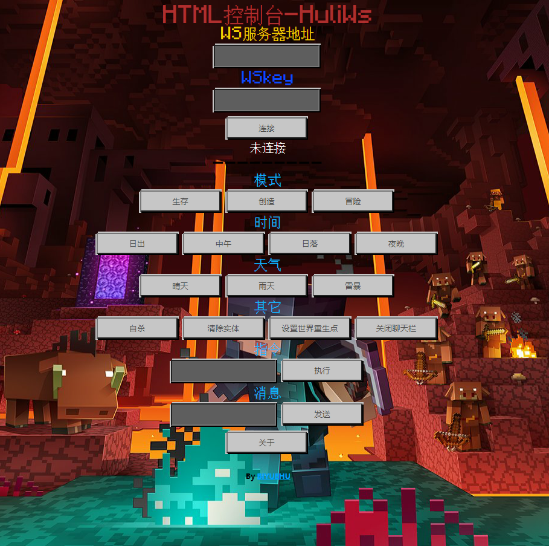
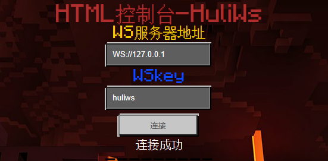

# HULIWS-Function Doc  
## Function  
### file structure  
**Root**  
- data  
  - function  
    - test.mcfunction  
    - (...mcfunction files)  
  - logs  
    - (...XXXX-XX-XX.log files)  
  - players  
    - (...playername_userid.info info of player files)    
  - blacklist.list  (Blacklist content)  
  - config.json  (Config file)  
- node_modules  
  - (node modules resources，Content omission)  
- web  
  - fonts  
    - (Fonts files，Content omission)  
  - images  
    - (Images files，Content omission)   
  - js  
    - (JS files，Content omission)  
  - styles  
    - (CSS files，Content omission)  
  - index.html  
- md  
  - (MD files，Content omission)  
- .gitignore  
- License  
- main.js  
- package.json  
- README.md  
- start.bat  

## detailed  
Next, we will explain the function of each file / folder in detail to understand the WS function  
### main.js  
For the main WS file, you can input node JS or NPM run huiws in CMD (when package.json is available)  
### start.bat  
Except for special cases, you only need to double-click the bat file to run this WS (under Windows)  
### data/  
Storage of main data  
The subfolder **function** stores mcfunction function files for calling  
The sub folder **logs** stores the log files in the time format of xxx-xx-xx  
Record event information table  
| event information                                                     |               remarks |
| ------------------------------------------------------------ | -----------------: |
| IP[IP] 连接到了服务器                                        |                    |
| HTML控制台:[string]                                          |                    |
| HTML控制台:[key]                                             |                    |
| HTML控制台:验证通过/key错误                                  |                    |
| HTML控制台:关闭了连接                                        |                    |
| HTML控制台:异常关闭                                          |                    |
| WebScoket收到了新的连接,设定Html控制台端口:[htmlport]完整URL:WS//WS服务器IP[LocalIP]:[htmlport]WSkey:[key] |                    |
| 读取失败                                                     |  read mcfunction files |
| [检测]\[客户端ID[wsi]]收到:[message]                         |                    |
| [playername]运行Say指令:[message]                            |                    |
| [playername]告诉[receivor]:[message]                         |                    |
| [playername]说:[message]                                     |                    |
| 方块[block]\(Id:[id])被物品[item]摧毁                        |                    |
| 方块[block]\(id:[id])被放置                                  |                    |
| [playername]加入了游戏 游戏颜色:[playercolor]                |                    |
| [playername]退出了游戏 游戏颜色[playercolor]                 |                    |
| 门户创建!                                                    |                    |
| 门户使用                                                     |                    |
| 玩家[cause]死了 用[killerentity]                             |                    |
| 怪物[mobtype]死了 用武器[weapontype],方式[methodtype]        |                    |
| 物品被摧毁了 通过[destructionmethodtype]                     |                    |
| 物品被创建了                                                 |                    |
| Boss[bosstype]被击杀                                         |                    |
| 吉祥物收到指令                                               |                    |
| 吉祥物被创建                                                 |                    |
The subfolder **players** stores player information files with the suffix. Info  
Its essence is just a JSON. Each player's information will only be recorded once and will not be updated. You can delete the corresponding information file and update it manually  
Information examples:  
```json  
{
	"body": {
		"eventName": "PlayerMessage",
		"measurements": null,
		"properties": {
			"AccountType": 1,
			"ActiveSessionID": "xxxxxxxx-xxxx-xxxx-xxxx-xxxxxxxxxxxx",
			"AppSessionID": "xxxxxxxx-xxxx-xxxx-xxxx-xxxxxxxxxxxx",
			"Biome": 29,
			"Build": "1.17.X",//GameVersion
			"BuildNum": "550xxxx",//VersionNumber
			"BuildPlat": 1,
			"Cheevos": false,
			"ClientId": "xxxxxxxx-xxxx-xxxx-xxxx-xxxxxxxxxxxx",
			"CurrentNumDevices": 1,
			"DeviceSessionId": "xxxxxxxx-xxxx-xxxx-xxxx-xxxxxxxxxxxx",
			"Difficulty": "NORMAL",
			"Dim": 0,
			"GlobalMultiplayerCorrelationId": "xxxxxxxx-xxxx-xxxx-xxxx-xxxxxxxxxxxx",
			"Message": "{\"rawtext\":[{\"text\":\"Input */help to Get Another\"}]}\n",
			"MessageType": "tell",
			"Mode": 1,
			"NetworkType": 0,
			"Plat": "Android/windows/ios/macos/...",//Os of the player
			"PlayerGameMode": 1,
			"Receiver": "xxxxxx",//playername
			"Sender": "External",
			"Seq": 242,
			"ServerId": "raknet:xxxxxxxxxxxxxxxxxxxx",
			"UserId": "xxxxxxxxxxxxxxxx",
			"WorldFeature": 0,
			"WorldSessionId": "xxxxxxxx-xxxx-xxxx-xxxx-xxxxxxxxxxxx",
			"isTrial": 0,
			"locale": "zh_CN",//The player is using language
			"vrMode": false
		}
	},
	"header": {
		"messagePurpose": "event",
		"requestId": "00000000-0000-0000-0000-000000000000",
		"version": 1
	}
}
```
**blacklist.list**  
The contents of the blacklist are stored  
**config.json**  
Configuration file. At present, there are few configurable parameters  
```json  
{  
    "port": 1,//WSServer Port,Number 0-65535   
    "allowhtmlconnections": true,//The Html can connections,Bool  
    "htmlport": null,//Ueless the configuration item  
    "key": "xxxxxxxxxxx"//WSkey,It's using in html connecting,String  
}  
```
### web  
Store the HTML console web page file, which can be copied to other places  
The subfolder **fonts** holds font files  
The subfolder **images** holds picture files  
The subfolder **styles** holds CSS files  
The subfolder **JS** stores JS and HTML console core files  
**index.html**  
HTML console home page file  

## Game  
### Built in instruction  
**Built in instruction**Generally, it refers to the built-in instruction of the WS, starting with "\*" sign + "/"  
There are currently six built-in instructions  
| Command        | Function                  | remarks                           |
| ----------- | --------------------- | ------------------------------ |
| */help      | Display the help page of huliws command  |                                |
| */helpy     | Show hidden instruction help page    |                                |
| */ct        | Show websocket connection time |                                |
| */about     | About info              |                                |
| */blacklist | Blacklist info            |                                |
| */clears    | Clear chat bar content        | After execution, you need to exit the chat bar to view the effect |

### Hidden instruction  
\*Words may have ambiguity, please pay attention to distinguish  
After connecting WS, you can use commands that are not normally used in the game. These commands are built-in to the game and start with "." comma + "/"  
There are currently eight hidden commands  
| Command                              | Function                         |
| --------------------------------- | ---------------------------- |
| ./closewebsocket                  | Close websocket            |
| ./gettopsolidblock \<x> \<y> \<z> | Get the coordinates of the top solid block of the coordinate point |
| ./querytarget \<selector\>  | Get the precise coordinates of solid points       |
| ./agent                           | Agent                       |
| ./enableencryption                | ?                         |
| ./closechat                       | Close Chat                   |
| ./geteduclientinfo                | Get version information                 |
| ./getlocalplayername              | Return the layer name                 |

### HTML console  
You can directly open the **Web / index. HTML** file through the browser, or hang it on your own website, or through our online website:[>This](http://111.67.196.75:81/tool/data/huliws)  
  
  
